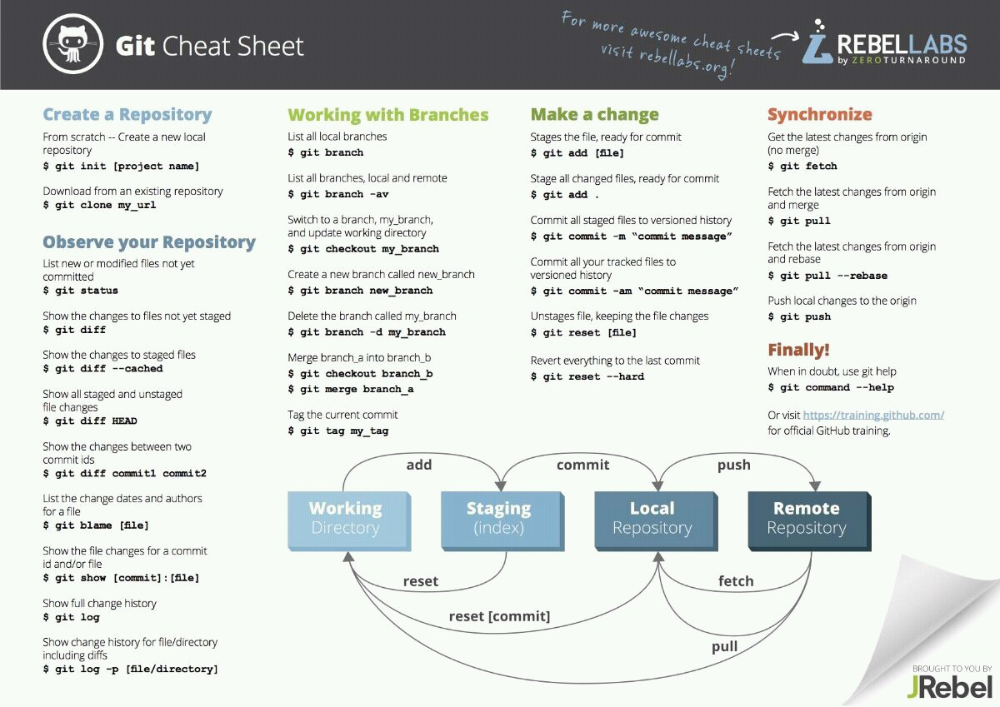

# HelpfulFiles

This is a document to help me, with learning Git and the commands keeping it handy and anytime to use.

> To undo a change in local repository

$ git checkout filename_that_needs_to_be_changed

This is for my information -

  

